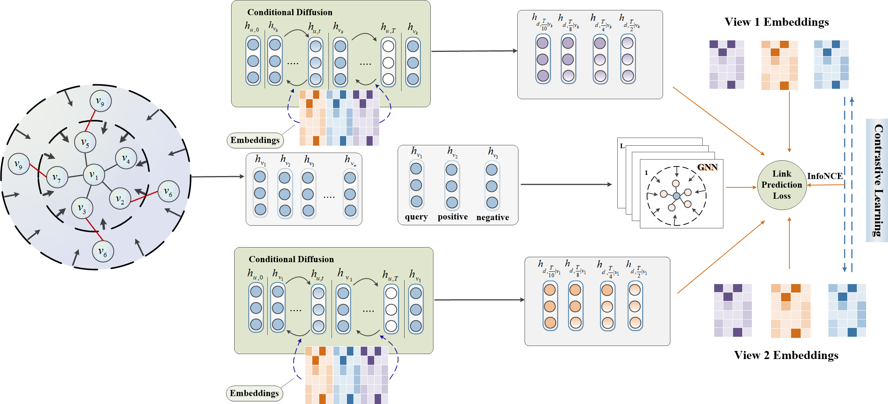

# DGCN: Diffusion-Enhanced Graph Contrastive Learning with Hierarchical Negative Sampling for Link Prediction
We provide the code (in pytorch) and datasets for our paper: "Diffusion-Enhanced Graph Contrastive Learning with Hierarchical Negative Sampling for Link Prediction" (DGCN).

## 1. Desription
The repository is organised as follows:

* data/: contains the 3 benchmark datasets: Cora, Citeseer and Actor. All datasets will be processed on the fly. Please extract the compressed file of each dataset before running.

* model/: contains our models.

## 2. Requirements
To install required packages
- pip install -r requirements.txt

## 3. Experiments
For reproducibility, please run these commands regarding to specific dataset:

- python main_cond.py --dataset=Cora[model_cond.py](../DGCN-main/model/model_cond.py)/Citeseer/Actor

